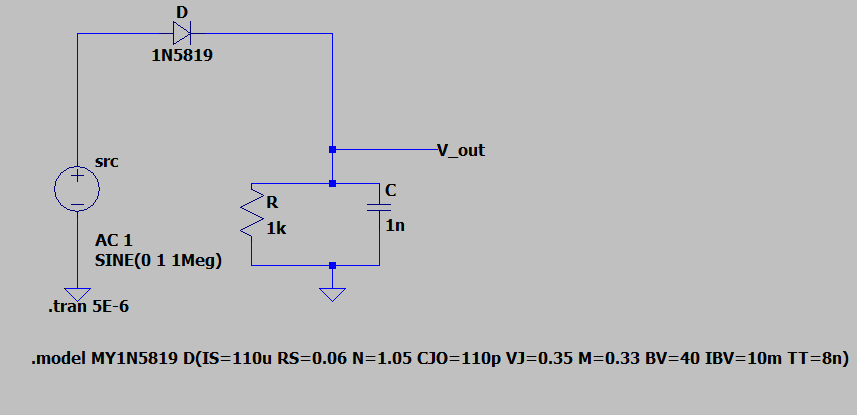
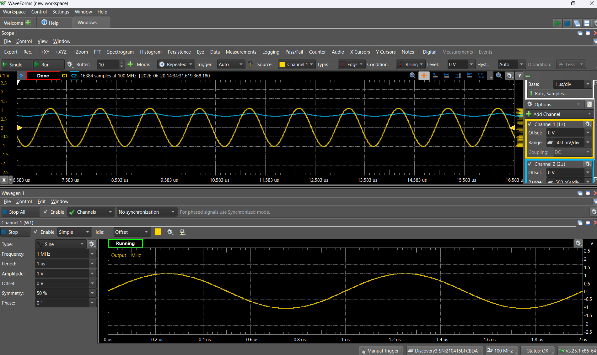

# AM Radio Reciever (In Progress)  

## Table of Contents

- [Summary](#summary)
- [Design Specifications](#design-specifications)
- [Project Diary](#project-diary)  
    - [June 12 2026 || Designing an LC Tank Circuit](#June-12-2026-||-Designing-an-LC-Tank-Circuit)
    - [June 17 2026](#June-17-2026)

## Summary

Inspired by the role of amplifiers in communication systems and RF applications, I am designing and building an AM radio receiver as a personal project.

This project combines analog circuit design concepts from my semiconductor coursework at the University of Washington with signal analysis techniques from my Continuous-Time Signals class. Through the design process, I am applying principles such as resonance, frequency selectivity, amplification, and demodulation to create a functional receiver capable of tuning and reproducing broadcast AM signals.

By integrating theory with hands-on implementation, this project has strengthened my understanding of RF communication systems and reinforced key skills in analog electronics, circuit analysis, and signal processing.

## Design Specifications

- Wire Antennae
- LC Tank Circuit
- Envelope Detector
- Low Pass Filter
- NMOS Amplifier

## Project Diary

### June 12 2026 || Designing an LC Tank Circuit

I aimed to pick up and demodulate waves transmitted by KNWN Northwest News Radio aka 1000 AM channel. The transmitter is on Vashon Island but is relatively powerful making it an ideal canidate for the project. 

I knew an antennae would capture all frequnecies available to it at once and then the subsequent circuit would need to isolate the desired frequency to the end of amplifying it. I decided to design an LC Tank Circuit to utilize the resonany frequency of the tank to isolate 1000 AM. 

Before building the circuit, I simulated the design on LTspice with a 100uH inductor and a 220pF capacitor. Observe:

 

This confirmed the designed LC tank circuit would use resonance to isolate and select the signal at 1000 kHz. I double-checked this simulation result by using the standard equation for resonance in an LC circuit. Observe:

$$f_0 \text{(in Hertz)}= \displaystyle \frac{1}{2 \pi \cdot \sqrt{LC}} = \displaystyle \frac{1}{2 \pi \cdot \sqrt{100 \cdot 10^{-6} \cdot 220 \cdot 10^{-12}}} = 1073022.47 \approx 1 \text{MHz}$$

I verified using the Analog Discovery's Network Analyzer feature that the LC circuit was working as intended at 1000 kHz.
[insert pic of the network analyzer screen on waveforms and the breadboard setu...p..]
### June 17 2026

The next step was using an envelope detector to extract the high frequency carrier signal component from the output of the tank circuit, ultimately, leaving the end-user with a clean, demodulated message signal.

- To avoid increased ripple, I made the RC time constant much greater than the carrier period. This made it so that the demodulation did not follow the high frequency cycle of the carrier wave which would introduce unwanted ripple into the output waveform.

- To more accurately craft the envelope, I made the RC time constant much less than the message period (assumed < 5kHz). This means the output waveform would follow changes in the envelope of the modulated signal-- failing to follow this constraint would result in the detector's capacitor discharging too slowly and diagnoally clipping the silhouette of the modulated message.

I did not know how to use an Analog Discovery to send an ampltude modulated wave through the envelope detector circuit so I used LTspice to capture data on changing the value of the RC time constant.

After using GPT AI to generate an appropriate spice model for the 1N5819 Schottky diode, I ran a transient analysis for different resistances. I plotted the data collected in Excel, observe:  

  

Recall, the envelope of the non-modulated sinusidal input waveform should be a straight line. Hence, the 10k resistance created a discharge pattern which most accurately reflected the input's envelope.

Based on the simulated results above, I verified the validity of the standard criterion for a well conditioned envelope detector time constant using the R and C values I selected for the sub-circuit:

$$\displaystyle \frac{1}{f_c} << RC << \displaystyle \frac{1}{f_m}$$

$$\displaystyle \frac{1}{1 MHz} << (10k\Omega) \cdot (1 nF) << \displaystyle \frac{1}{5kHz} $$

$$ \implies 1 \mu s << 10 \mu s << 200 \mu s$$

 I then used the Analog Discovery Module and Waveforms software to send in a nonmodulated wave at carrier frequency and measure the response on the oscilliscope. Observe:
 

In the screenshot of the oscilloscope above, channel 1 depicted the 1MHz wave being sent in to the circuit, and channel 2 represented the output of the cascaded LC tank circuit and envelope detector. This inspred confidence as the demodulated envelope was a straight line as predicted by the Excel plot of the LTspice simulation.

### July 1 2026

[talk about finding out how to use the modulation function of waveforms]

### July 13 2026

[talk about finding an antennae and problems that arose

